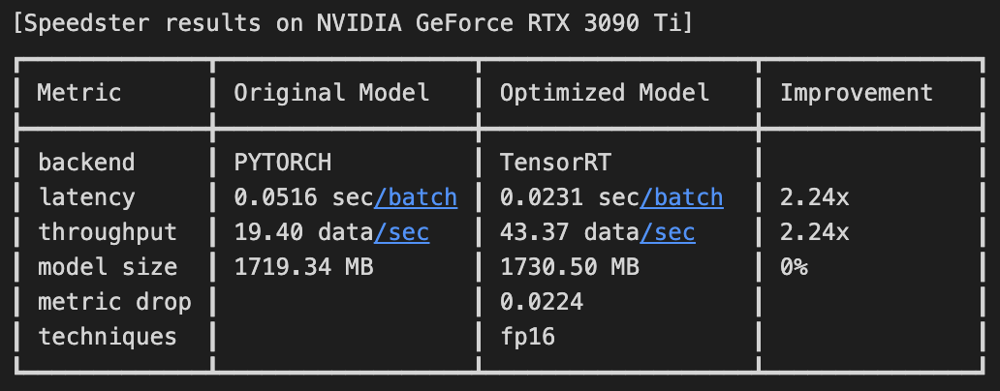

# Getting started with Stable Diffusion optimization
In this section, we will learn about the 4 main steps needed to optimize Stable Diffusion models from the `Diffusers` library:

1. [Environment Setup](#1-input-model-and-data)
2. [Input your model and data](#2-input-model-and-data)
3. [Run the optimization](#3-run-the-optimization)
4. [Save your optimized model](#4-save-your-optimized-model)
5. [Load and run your optimized model in production](#5-load-and-run-your-optimized-model-in-production)

## 1) Environment Setup (GPU only)
In order to optimize a Stable Diffusion model, you have to ensure that your environment is correctly set up according to these requirements: `CUDA>=12.0` and `tensorrt>=8.6.0`.

From TensorRT 8.6, all the tensorrt pre-built wheels released by nvidia support only `CUDA>=12.0`. Speedster will install `tensorrt>=8.6.0` automatically in the auto-installer only if it detects CUDA>=12.0, otherwise it will install `tensorrt==8.5.3.1`. In that case, you will have to upgrade your CUDA version and then to upgarde tensorrt to 8.6.0 or above.

There should be a way to run TensorRT 8.6 also with CUDA 11, but it requires installing TensorRT in a different way, you can check this issue: https://github.com/NVIDIA/TensorRT/issues/2773. Otherwise, we highly suggest to just upgrade to CUDA 12.

You can check your CUDA version with the following command:

```bash
nvidia-smi
```

If you have CUDA<12.0, you can upgrade it at this link: https://developer.nvidia.com/cuda-downloads

You can check your TensorRT version with the following command:

```bash
python -c "import tensorrt; print(tensorrt.__version__)"
```

If you have an older version, after ensuring you have `CUDA>=12.0` installed, you can upgrade your TensorRT version by running:
```
pip install -U tensorrt
```

## 2) Input model and data

!!! info
    In order to optimize a model with `Speedster`, first you should input the model you want to optimize and load some sample data that will be needed to test the optimization performances (latency, throughput, accuracy loss, etc). 


For Stable Diffusion models Speedster expects the input data to be a list of sentences: ```List[str]```

```python
import torch
from speedster import optimize_model
from diffusers import StableDiffusionPipeline


# Load Stable Diffusion 1.4 as example
model_id = "CompVis/stable-diffusion-v1-4"
device = "cuda" if torch.cuda.is_available() else "cpu"

if device == "cuda":
    # On GPU we load by default the model in half precision, because it's faster and lighter.
    pipe = StableDiffusionPipeline.from_pretrained(model_id, revision='fp16', torch_dtype=torch.float16)
else:
    pipe = StableDiffusionPipeline.from_pretrained(model_id)

# Create some example input data
input_data = [
    "a photo of an astronaut riding a horse on mars",
    "a monkey eating a banana in a forest",
    "white car on a road surrounded by palm trees",
    "a fridge full of bottles of beer",
    "madara uchiha throwing asteroids against people"
]
```

Now your input model and data are ready, you can move on to [Run the optimization](#2-run-the-optimization) section 🚀.

## 3) Run the optimization
Once the `model` and `input_data` have been defined, everything is ready to use Speedster's `optimize_model` function to optimize your model. 

The function takes the following arguments as inputs:

- `model`: model to be optimized in your preferred framework (A Diffusers pipe in this case)
- `input_data`: sample data needed to test the optimization performances (latency, throughput, accuracy loss, etc)
- `optimization_time`: if "constrained" mode, `Speedster` takes advantage only of compilers and precision reduction techniques, such as quantization. "unconstrained" optimization_time allows it to exploit more time-consuming techniques, such as pruning and distillation 
- `metric_drop_ths`: maximum drop in your preferred accuracy metric that you are willing to trade to gain in acceleration

and returns the accelerated version of your model 🚀.

``` python
from speedster import optimize_model

# Run Speedster optimization
optimized_model = optimize_model(
    pipe, 
    input_data=input_data, 
    optimization_time="unconstrained",
    metric_drop_ths=0.05
)
```

Internally, `Speedster` tries to use all the compilers and optimization techniques at its disposal along the software to hardware stack to optimize the model. From these, it will choose the ones with the lowest latency on the specific hardware.

At the end of the optimization, you are going to see the results in a summary table like the following:



If the speedup you obtained is good enough for your application, you can move to the [Save your optimized model](#3-save-your-optimized-model) section to save your model and use it in production.

If you want to squeeze out even more acceleration out of the model, please see the [`optimize_model` API](../advanced_options.md#optimize_model-api) section. Consider if in your application you can trade off a little accuracy for much higher performance and use the `metric`, `metric_drop_ths` and `optimization_time` arguments accordingly.

## 4) Save your optimized model
After accelerating the model, it can be saved using the `save_model` function:

```python
from speedster import save_model

save_model(optimized_model, "model_save_path")
```

Now you are all set to use your optimized model in production. To explore how to do it, see the [Load and run your optimized model in production](#4-load-and-run-your-optimized-model-in-production) section.

## 5) Load and run your optimized model in production
Once the optimized model has been saved,  it can be loaded with the `load_model` function:
```python
from speedster import load_model

optimized_model = load_model("model_save_path", pipe=pipe)
```

In this case we must provide also the original pipe as argument to the load_function, Speedster will automatically load the optimized model and replace the original UNet inside the pipe.

The optimized model can be used for accelerated inference in the same way as the original model:

```python
# Use the accelerated version of your Stable Diffusion model in production
output = optimized_model(test_prompt).images[0]
```

!!! info
    The first 1-2 inferences could be a bit slower than expected because some compilers still perform some optimizations during the first iterations. After this warm-up time, the next ones will be faster than ever.

If you want to know more about how to squeeze out more performances from your models, please visit the [Advanced options](../advanced_options.md) section.