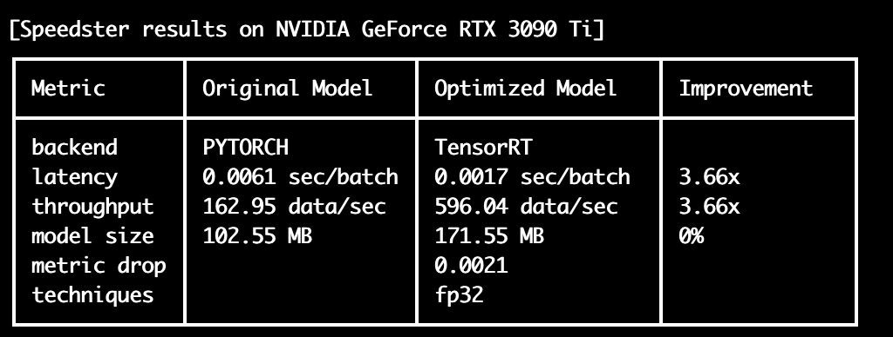

# Getting started with PyTorch optimization
In this section, we will learn about the 4 main steps needed to optimize PyTorch models:

1. [Input your model and data](#1-input-model-and-data)
2. [Run the optimization](#2-run-the-optimization)
3. [Save your optimized model](#3-save-your-optimized-model)
4. [Load and run your optimized model in production](#4-load-and-run-your-optimized-model-in-production)

## 1) Input model and data

!!! info
    In order to optimize a model with `Speedster`, first you should input the model you want to optimize and load some sample data that will be needed to test the optimization performances (latency, throughput, accuracy loss, etc). 


For PyTorch models we support two types of input data:

* Custom data format
* PyTorch DataLoader

=== "Custom Data Format"
    Input data is a ```List[Tuple[Tuple[tensor, ...], tensor]]```

    - Each element of the list is a tuple, which represents a batch of the dataset.
    - In each tuple, the first element is another tuple containing a value for each input tensor of the model, while the second element is a tensor containing the labels of that batch of data. The label is optional, so it can be omitted.

    ``` python
    import torch
    import torchvision.models as models

    # Load a resnet as example
    model = models.resnet50()

    # Provide input data for the model    
    input_data = [((torch.randn(1, 3, 256, 256), ), torch.tensor([0])) for _ in range(100)]
    ```

    See below further examples with custom format:
    ``` python
    # Dataset for a model that takes 1 input, containing 100 batches of data with bs=1 with labels
    input_data = [((torch.randn(1, 3, 256, 256), ), torch.tensor([0])) for _ in range(100)]

    # Dataset for a model that takes 2 inputs, containing 100 batches of data with bs=5 with labels
    input_data = [((torch.randn(5, 3, 256, 256), torch.randn(5, 3, 256, 256), ), torch.tensor([0, 1, 0, 1, 1])) for _ in range(100)]

    # Dataset for a model that takes 1 input, containing 100 batches of data with bs=1 without labels
    input_data = [((torch.randn(1, 3, 256, 256), ), ) for _ in range(100)]
    ```

    Now your input model and data are ready, you can move on to [Run the optimization](#2-run-the-optimization) section 🚀.

=== "PyTorch DataLoader"
    We support the following DataLoader types:

    * Tensor only
    * Tensor and labels


    For models with multiple inputs, we support the following types:

    - input_1, input_2, ..., input_n, label
    - (input_1, input_2, ..., input_n), label

    ```python
    import torch
    import torchvision.models as models

    # Load a resnet as example
    model = models.resnet50()

    # Use your PyTorch DataLoader in any of the standard format
    input_data = <insert your PyTorch DataLoader here>
    ```

    Now your input `model` and `input_data` are ready, you can move on to the [Run the optimization](#2-run-the-optimization) section.

## 2) Run the optimization
Once the `model` and `input_data` have been defined, everything is ready to use Speedster's `optimize_model` function to optimize your model. 

The function takes the following arguments as inputs:

- `model`: model to be optimized in your preferred framework (PyTorch in this case)
- `input_data`: sample data needed to test the optimization performances (latency, throughput, accuracy loss, etc)
- `optimization_time`: if "constrained" mode, `Speedster` takes advantage only of compilers and precision reduction techniques, such as quantization. "unconstrained" optimization_time allows it to exploit more time-consuming techniques, such as pruning and distillation 
- `metric_drop_ths`: maximum drop in your preferred accuracy metric that you are willing to trade to gain in acceleration

and returns the accelerated version of your model 🚀.

``` python
from speedster import optimize_model

# Run Speedster optimization
optimized_model = optimize_model(
    model, 
    input_data=input_data, 
    optimization_time="constrained",
    metric_drop_ths=0.05
)
```

Internally, `Speedster` tries to use all the compilers and optimization techniques at its disposal along the software to hardware stack to optimize the model. From these, it will choose the ones with the lowest latency on the specific hardware.

At the end of the optimization, you are going to see the results in a summary table like the following:



If the speedup you obtained is good enough for your application, you can move to the [Save your optimized model](#3-save-your-optimized-model) section to save your model and use it in production.

If you want to squeeze out even more acceleration out of the model, please see the [`optimize_model` API](../advanced_options.md#optimize_model-api) section. Consider if in your application you can trade off a little accuracy for much higher performance and use the `metric`, `metric_drop_ths` and `optimization_time` arguments accordingly.

## 3) Save your optimized model
After accelerating the model, it can be saved using the `save_model` function:

```python
from speedster import save_model

save_model(optimized_model, "model_save_path")
```

Now you are all set to use your optimized model in production. To explore how to do it, see the [Load and run your optimized model in production](#4-load-and-run-your-optimized-model-in-production) section.

## 4) Load and run your optimized model in production
Once the optimized model has been saved,  it can be loaded with the `load_model` function:
```python
from speedster import load_model

optimized_model = load_model("model_save_path")
```

The optimized model can be used for accelerated inference in the same way as the original model:

```python
# Use the accelerated version of your PyTorch model in production
output = optimized_model(input_sample)
```

!!! info
    The first 1-2 inferences could be a bit slower than expected because some compilers still perform some optimizations during the first iterations. After this warm-up time, the next ones will be faster than ever.

If you want to know more about how to squeeze out more performances from your models, please visit the [Advanced options](../advanced_options.md) section.