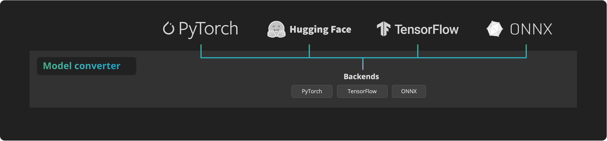
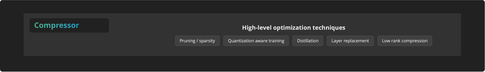
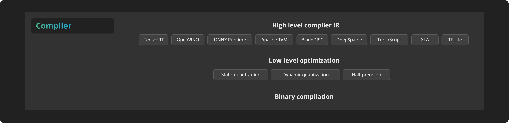

# Key concepts

In this section we are going to learn the architectural design of the 4 building blocks of `Speedster`.

- [x]  **Converter**: converts the input model from its original framework to the framework backends supported by Speedster, namely PyTorch, TensorFlow, and ONNX. This allows the Compressor and Optimizer modules to apply any optimization technique to the model.
- [x]  **Compressor**: applies various compression techniques to the model, such as pruning, knowledge distillation, or quantization-aware training.
- [x]  **Optimizer**: converts the compressed models to the intermediate representation (IR) of the supported deep learning compilers. The compilers apply both post-training quantization techniques and graph optimizations, to produce compiled binary files.
- [x]  **Inference Learner**: takes the best performing compiled model and converts it to the same interface as the original input model.

The **compressor** stage leverages the following open-source projects:

- [Intel/neural-compressor](https://github.com/intel/neural-compressor): targeting to provide unified APIs for network compression technologies, such as low precision quantization, sparsity, pruning, knowledge distillation, across different deep learning frameworks to pursue optimal inference performance.
- [SparseML](https://github.com/neuralmagic/sparseml): libraries for applying sparsification recipes to neural networks with a few lines of code, enabling faster and smaller models.

The **compiler stage** leverages the following open-source projects:

- [Apache TVM](https://github.com/apache/tvm): open deep learning compiler stack for cpu, gpu and specialized accelerators.
- [BladeDISC](https://github.com/alibaba/BladeDISC): end-to-end Dynamic Shape Compiler project for machine learning workloads.
- [DeepSparse](https://github.com/neuralmagic/deepsparse): neural network inference engine that delivers GPU-class performance for sparsified models on CPUs.
- [OpenVINO](https://github.com/openvinotoolkit/openvino): open-source toolkit for optimizing and deploying AI inference.
- [ONNX Runtime](https://github.com/microsoft/onnxruntime): cross-platform, high performance ML inferencing and training accelerator
- [TensorRT](https://github.com/NVIDIA/TensorRT): C++ library for high performance inference on NVIDIA GPUs and deep learning accelerators.
- [TFlite](https://github.com/tensorflow/tflite-micro) and [XLA](https://github.com/tensorflow/tensorflow/tree/master/tensorflow/compiler/xla): open-source libraries to accelerate TensorFlow models.

## Model converter
!!! Definition
    The Converter converts the input model from its original input framework to the framework backends supported by `Speedster`. This conversion enables the Compressor and the Compiler modules to apply all the optimization techniques without being constrained by the framework of your input model.

`Speedster` supports deep learning models in the following input frameworks:

- Hugging Face
- ONNX
- PyTorch
- TensorFlow

`Speedster` now includes 3 backends:

- **ONNX backend**, which supports models in any input framework.
- **PyTorch backend**, which supports input models in PyTorch and ONNX and Hugging Face. 
- **TensorFlow backend**, which supports input models in TensorFlow and ONNX.

As you notice, to date, not all cross-conversions from input frameworks to each `Speedster` backend are supported. 

Let's see a couple of examples to better understand the potenatiality of the Converter block:

1. PyTorch model as input: first of all Speedster will try the compilers available in the PyTorch backend pipeline, then it will convert it to ONNX and will try also the ones available in the ONNX backend optimization pipeline. Finally, the best one among them will be chosen and returned as the optimized model in your input framework (in this case PyTorch).

2. HuggingFace model as input: Let's assume that for your specific use case, the best optimization technique is a specific type of dynamic quantization only supported by PyTorch. If you feed a Hugging Face model into Speedster, the Converter will first transform your model into a PyTorch model. Speedster will then quantize it and finally return it as an Hugging Face model.

## Compressor

The compressor applies various compression techniques to the model:

- Block-wise un/structured sparsity (🎉 launched in 0.4.0 🎉)
- Knowledge distillation (to be supported)
- Layer replacement (to be supported)
- Low-rank compression (to be supported)
- Quantization-aware training (to be supported)
- SparseML (🎉 launched in 0.4.0 🎉)

## Compiler

The Compiler block converts the compressed models to the intermediate representation (IR) of the supported deep learning compilers. The different DL compilers perform both the low-level optimizations, which mostly consist of various quantization techniques, and graph optimizations. Finally, the model is compiled into binary.

Supported deep learning compilers:

- Apache TVM
- BladeDISC (🎉 launched in 0.4.0 🎉)
- DeepSparse (🎉 launched in 0.4.0 🎉)
- MLIR (open pull request 👩‍💻)
- ONNX Runtime
- OpenVINO
- TensorRT
- TF Lite / XLA
- TorchScript

Supported low-level optimizations:

- Static quantization
- Dynamic quantization
- Half-precision
- Low-bit quantization on TVM (to be supported)

## Inference learner

The Learner, or Inference Learner, selects the most performing compiled model on your hardware and converts it to the same interface as the original input model.

