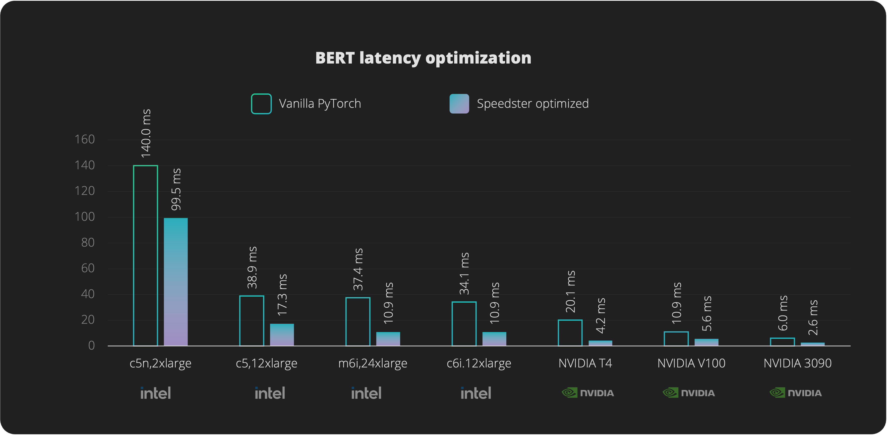
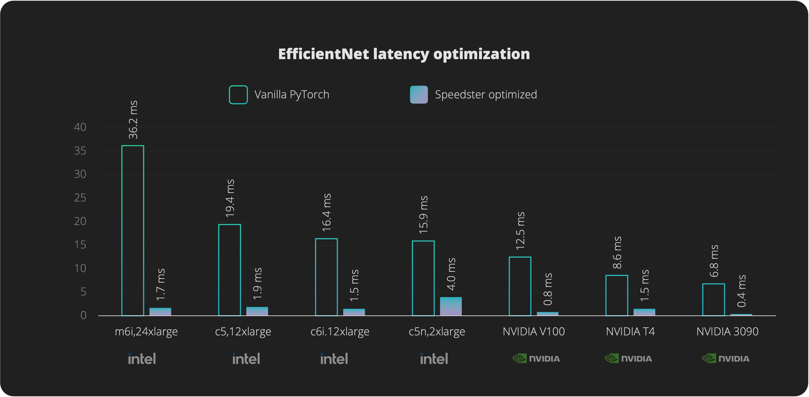
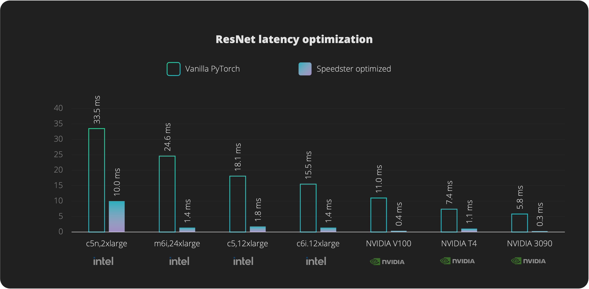

# Benchmarks

!!! info
    In this section you are going to learn how `Speedster` accelerates the inference of various models on different hardware architecture.

Here we provide a preview of the following accelerated models:

- [Bert](#bert)
- [YoloV5](#yolov5)
- [EfficientNet](#efficientnet)
- [GPT2](#gpt2)
- [ResNet](#resnet)
- [Roberta](#roberta)

The above models are tested on very popular hardware architecture and instances:

- AWS - c5n,2xlarge
- AWS - c5,12xlarge
- AWS - c6i.12xlarge
- AWS - m6i,24xlarge
- NVIDIA T4
- NVIDIA V100
- NVIDIA 3090

## Bert

## YoloV5

## EfficientNet

## GPT2

## ResNet

## Roberta
